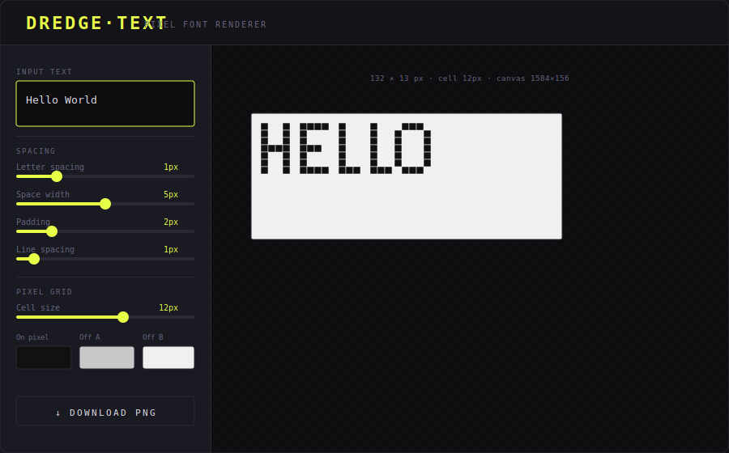
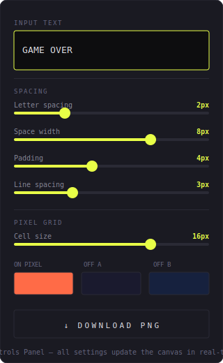
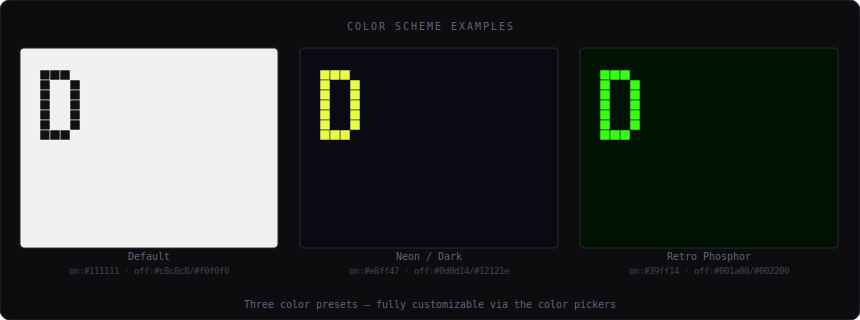
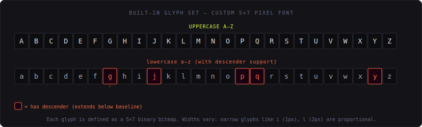

# Pixel·TEXT — Pixel Font Renderer

> A zero-dependency, single-file pixel font renderer that converts text into stylized bitmap art and exports it as a PNG.



---

## What it does

**Pixel Text** is a browser-based tool that renders your text using a hand-crafted 5×7 pixel bitmap font, displayed on a customizable checkerboard pixel grid. You control every visual parameter — cell size, spacing, colors — and export the result as a crisp PNG, ready for games, thumbnails, retro UIs, or anywhere you want that authentic pixel-art aesthetic.

No libraries. No build step. Drop `index.html` in a browser and go.

---

## Quick Start

```bash
# No installation needed — just open the file
open index.html
```

Or host it anywhere static:

```bash
npx serve .
# → http://localhost:3000
```

---

## Interface

The UI is split into two zones: a **controls sidebar** on the left, and a **live canvas preview** on the right.



### Controls Reference

| Control | Range | Default | What it does |
|---|---|---|---|
| **Input Text** | any string | `"Pixel"` | The text to render. Supports newlines for multi-line output. |
| **Letter spacing** | 0–5px | 1px | Horizontal gap between characters. |
| **Space width** | 1–10px | 5px | Width of the space character. |
| **Padding** | 0–10px | 2px | Empty border around the entire canvas. |
| **Line spacing** | 0–10px | 1px | Blank rows inserted between lines (multi-line text). |
| **Cell size** | 4–24px | 12px | How many screen pixels each bitmap pixel occupies. |
| **On pixel** | color | `#111111` | Color of "lit" pixels (the text itself). |
| **Off A / Off B** | color | `#c8c8c8` / `#f0f0f0` | Two alternating colors for the checkerboard background. |

All controls update the canvas **in real time** — no submit button needed.

---

## Examples

### Example 1 — Classic dark-on-light

Default settings. Clean, high contrast, like a Game Boy screen in the light.

```
Text:           Hello World
Cell size:      12px
On pixel:       #111111
Off A / Off B:  #c8c8c8 / #f0f0f0
```

### Example 2 — Neon on dark

Crank the cell size up, flip the colors for a terminal glow aesthetic.

```
Text:           GAME OVER
Cell size:      16px
On pixel:       #e8ff47
Off A / Off B:  #0d0d14 / #12121e
```

### Example 3 — Retro phosphor green

Evokes a vintage CRT monitor.

```
Text:           PRESS START
Cell size:      14px
On pixel:       #39ff14
Off A / Off B:  #001a00 / #002200
```



### Example 4 — Multi-line with spacing

Use newlines in the text box to create multi-line output. Line spacing controls the gap.

```
Text:
  SCORE
  009800

Line spacing:   4px
Letter spacing: 2px
Cell size:      10px
```

---

## The Font

Pixel Text uses a **custom 5×7 pixel bitmap font** — every character is hardcoded as a binary row pattern directly in the JS. The font covers:

- Full uppercase A–Z
- Full lowercase a–z (with proper **descender** support for `g`, `j`, `p`, `q`, `y`)
- Numbers 0–9
- Common punctuation



### How glyphs work

Each character is defined as an object:

```js
'A': {
  rows: ['01110','10001','11111','10001','10001','10001','10001'],
  width: 5,
  descender: 0
}
```

- **`rows`** — array of 7 binary strings, top to bottom. `1` = lit pixel, `0` = off pixel.
- **`width`** — character width in pixels (most are 5, some narrow glyphs like `i`, `l`, `t` are 1–3).
- **`descender`** — number of extra rows the glyph extends *below* the baseline (e.g. `g` and `p` have `descender: 2`).

Unknown characters render as a 5×7 solid block as a visible placeholder.

---

## How rendering works

```
Input text
    │
    ▼
Split into lines  ──→  renderLine() per line
                            │
                            ▼
                       Build pixel grid (Uint8Array rows)
                       Place each glyph at correct column
                            │
                            ▼
                       buildFullGrid()
                       Merge lines + inject line-spacing rows
                            │
                            ▼
                       renderPixelCanvas()
                       Scale grid by cellSize
                       Draw checkerboard + on-pixels via ImageData
                       1px white border per cell edge
                            │
                            ▼
                       canvas.toDataURL() → PNG download
```

The renderer uses raw `ImageData` for performance — no per-pixel `fillRect` calls.

---

## Export

Click **↓ Download PNG** to save the canvas as `pixel-text.png`.

The exported PNG is pixel-perfect at whatever cell size you chose. Upscale-friendly: a cell size of 1px gives a compact true-resolution bitmap; 24px gives a large, blocky, poster-ready render.

---

## Adding characters

To extend the font, add an entry to the `GLYPHS` object in the `<script>` block:

```js
'!': {
  rows: ['00100','00100','00100','00100','00100','00000','00100'],
  width: 5,
  descender: 0
},
```

Each row string must be the same length as `width`. Use `1` for a filled pixel and `0` for empty.

---

## File structure

```
index.html          ← everything: HTML, CSS, JS, font data, renderer
imgs/               ← documentation images (README only)
  overview.svg
  controls.svg
  color-schemes.svg
  glyph-map.svg
```

The entire application is **one self-contained HTML file** with no external dependencies beyond two Google Fonts (VT323 + IBM Plex Mono, loaded over CDN for the UI chrome only — the pixel renderer itself uses no fonts).

---

## License

MIT — do whatever you want with it.
